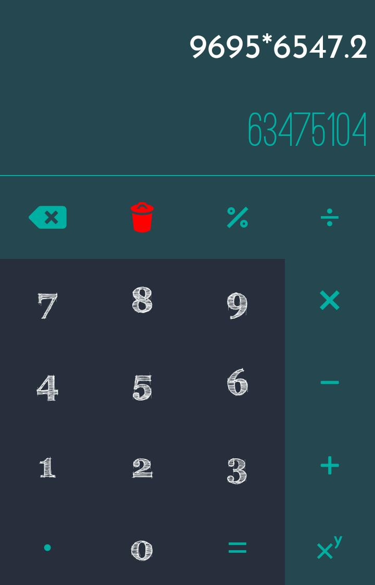

## Front view

<p align="center">


</p>

<!--  -->

<!--  -->


https://user-images.githubusercontent.com/50518179/139589030-4561f5fa-495a-46ca-b2b4-c4f61b1f3db7.mp4


## Summary

the following is code for Calculator using React Native Which has all basic operations

```
+ - * / ^ %
```

all using states in react native

## To run this app

clone the repository and run command

```
npm install
```

or

```
npm install --save --legacy-peer-deps
```

## To create unsigned .apk (android build)

Run the following commands

```
react-native bundle --platform android --dev false --entry-file index.js --bundle-output android/app/src/main/assets/index.android.bundle --assets-dest android/app/src/main/res/
cd android && ./gradlew assembleDebug
```

<!--  -->
